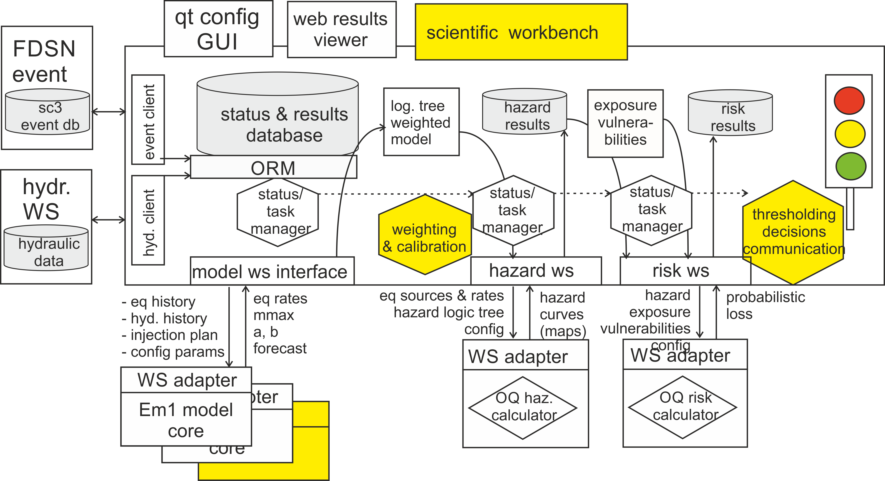

# RT-RAMSIS

Real Time Risk Assessment and Mitigation for Induced Seismicity.

RT-RAMSIS is a KTI project that is developed in collaboration with Geo-Energie
Suisse AG. It is the successor of ATLS, a prototype software developed under
GEOSIM.

**NOTE: Geo-Energie Suisse AG and SED have agreed not to actively distribute
RT-RAMSIS to third parties. It is internal use only. If you're an employee of
either company you must not distribute the code to anyone without prior 
permission of GES or SED.** 

RT-RAMSIS is licensed under the [*AGPL* license]
(https://gitlab.seismo.ethz.ch/indu/rt-ramsis/blob/master/LICENSE) to be 
compatible with some of the libraries we use.


## System design and components

### Summary of the RAMSIS workflow

RT-RAMSIS is a controller for real-time (or playback) time dependent seismicity,
seismic hazard, and risk assessment. 

As data input, it expects seismic information available in QuakeML from an 
fdsnws/event standard web service, and (for induced seismicity), borehole, and 
borehole operation (flow & pressure measurements) from a HYDWS web service.

Internally, it is organized in projects.
For each project, a series of scenarios can be defined. A scenario is defined, 
*  in its seismicity stage, it is defined by a series of forecast models with 
respective configuration, and "injection plan" (planned future hydraulic data)
* in its hazard stage, by an Openquake logic tree model containing the 
seismicity models as branches, and providing the possibility to weight them
* in its risk stage, [...pending]

Scenarios have execution times, and timespans for which a/b values (seismicity 
stages), hazard curves and maps (hazard), and (risk) are calculated. 

Each seismicity model of a scenario is configured for a volume, or a set of 
subvolumes, for which it is executed.

All these configurations and settings are done in a QT-based GUI local to the 
machine running the RAMSIS core.

RAMSIS constantly checks the available configuration, and if current (or 
modelled) time matches a scenario execution time, it
1.  Invokes all due seismicity models via a web service interface, providing 
them with model configuration, definition of the target volumes, full seismic
and hydraulic history, and injection plan
2. the models return a and b values for each volume and requested time interval.
3. RAMSIS uses these results to parametrize the source models of an OpenQuake
hazard calculation, and invokes this using the OpenQuake web service API
4. After completion of the hazard calculations, RAMSIS fetches the results
and stores hazard maps & curves to a database
5. [risk computation, pending]
6. [threshold analysis and alarming, pending]

All calculation configurations, as well as calculation results are (will be) 
browsable in a web-based read-only GUI, based on OpenCMS & SED Flexitable 
technology.





### Input of seismic data
Seismic data is expected to be provided in QuakeML format from an FDSN/event web 
service, specified at http://www.fdsn.org/webservices/fdsnws-event-1.2.pdf .
The typical way to provide this service may be to populate a SeisComP3 
compatible database and run the SeisComP3 fdsnws module on top of it: 
https://docs.gempa.de/seiscomp3/current/apps/fdsnws.html

The location and boundary parameters of the FDSN/event web service are a RAMSIS
project configuration

### Input of hydraulic data data
Hydraulic data is expected in json format from a HYDWS web service. SED provides
HYDWS as a ready-to-use freeware software package at 
https://gitlab.seismo.ethz.ch/sed-infra/hydws , alongside with documentation. 
HYDWS uses (and installs) a postgres database for hydraulic data. Auxiliary 
Software to insert hydraulic data from project-specific measurement gear into
the database needs to be implemented specifically for each service setup.

Note: HYDWS supports multiple boreholes, borehole sections, and meadurement
parameters. Individual seismicity models may need, or support only a subset of 
of those. It is checked at runtime whether a seismicity model can handle the
hydraulic data it is provided with, and whether it is sufficient to parametrize
the model

The location and boundary parameters of the HYDWS web service are a RAMSIS
project configuration

## Installation (for developers)

Make sure the dependencies

* git
* graphviz
* libxml2-dev
* libxslt1-dev
* python3.6
* python3-pip
* python-virtualenv
* zlib1g-dev

are installed on your system.

Clone the repository

```bash
$ export PATH_PROJECTS=$HOME/work/projects
$ mkdir -pv $PATH_PROJECTS
$ git clone https://gitlab.seismo.ethz.ch/indu/RAMSIS.git $PATH_PROJECTS/RAMSIS
```

Set up a virtual environment

```bash
$ virtualenv -p $(which python3.6) $PATH_PROJECTS/RAMSIS/venv3
$ source $PATH_PROJECTS/RAMSIS/venv3/bin/activate
```

Install [OpenQuake](https://github.com/gem/oq-engine)

```bash
$ export PATH_THIRD=$HOME/work/3rd
$ mkdir -pv $PATH_THIRD
$ git clone https://github.com/gem/oq-engine.git $PATH_THIRD/oq-engine
$ pip install -r $PATH_THIRD/oq-engine/requirements-py36-linux64.txt
$ pip install -e $PATH_THIRD/oq-engine/
```

and install the custom GSIMs

```bash
$ cp -v $PATH_PROJECTS/RAMSIS/RAMSIS/resources/oq/gmpe-gsim/* \
  $PATH_THIRD/oq-engine/openquake/hazardlib/gsim/
```

Start the OpenQuake engine

```bash
$ oq engine --upgrade-db -y
```

Finally install RAMSIS

```bash
$ cd $PATH_PROJECTS/RAMSIS
$ make install
```

Test your installation with

```bash
$ ramsis -h
```
**NOTE:** In the description above the variables `PATH_PROJECTS` and
`PATH_THIRD` are used. Adjust the corresponding values according to your needs.


## Developers and Contributors

Please read the [Contribution
guide](https://gitlab.seismo.ethz.ch/indu/rt-ramsis/blob/master/CONTRIBUTING.md)
before you add code to the project. The contribution guide also contains infos
on how you can access the code documentation.

## Copyright
Copyright (c) 2015-2018, Swiss Seismological Service, ETH Zurich and
Geo-Energie Suisse AG, Zurich
